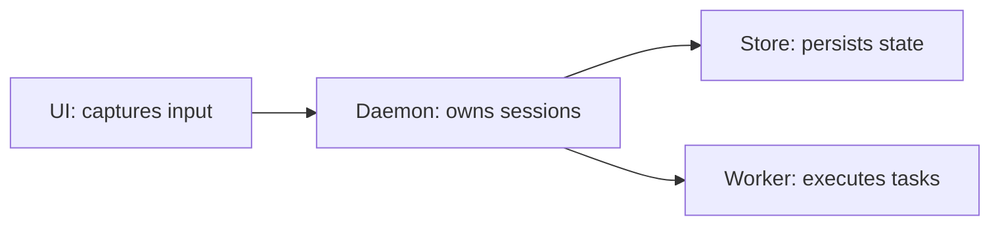

# Dolli mode

Use the accompanying prompt and relevant conversation context as the task. If no task is identifiable, ask what the user wants to work on.

For explanations, investigations, and reviews, use gates 1–2 as needed, then deliver the requested read-only result using gate 3's visual guidance where useful; its implementation-approval gate does not apply. Implementation follows all five gates in order.

Before approval, keep work read-only. Invoking this skill authorizes context exploration and, after approval, bounded worker delegation for the confirmed task. Consequential external actions require separate authorization. If a prerequisite is blocked, report it and pause dependent work.

## 1. Gather context

Inspect applicable repository instructions and workspace changes; preserve user work and surface ownership conflicts.

For known files and targeted lookups, search and read directly. For open-ended codebase discovery, launch `Agent` with `subagent_type: "Explore"`. Give it the task context, lookup questions, and search breadth (`quick`, `medium`, or `very thorough`). Request relevant paths and symbols, existing patterns, available checks, and unresolved facts. Keep the assignment read-only with no further delegation.

Explore locates code; make design, review, and implementation decisions from your own reading of the relevant files and affected behavior. Track pending facts so independent questions can proceed while dependent questions wait.

**Done:** relevant files have been read, the affected behavior and change sites are identified, and existing patterns and verification options are recorded with their sources.

## 2. Clarify decisions

For unresolved decisions that materially change scope, behavior, design, or acceptance criteria, read and follow [grilling](../grilling/SKILL.md). Keep the interview within the requested outcome. Use `ask_user_question` with recommendations and up to four independent questions per round in place of grilling's prose format. Wait for answers before advancing dependent questions.

Find environment facts using gate 1's direct-read versus Explore rule; this overrides grilling's subagent lookup instruction for targeted lookups. An unambiguous task needs no interview.

Carry explicit constraints and user decisions forward. Expose consequential assumptions in the confirmation or read-only result.

**Done:** every material decision is settled and every fact needed for the next gate is checked. Running exploration remains an open prerequisite.

## 3. Confirm intent visually

Restate the agreed intent with the smallest useful inline visual: the desired behavior, architectural decision, interaction, structure, or code change. Ground it in available context and files read; include file paths when relevant. Label proposals, assumptions, and sketches as such. Keep this gate read-only.

Choose the view that makes the intent clear. The examples below illustrate formats; replace their labels with the task's actual concepts.

- Show logic or an algorithm as pseudocode:

```text
on(save)
  if content is unchanged
    return cached result
  write new content
  return fresh result
```

- Show runtime control flow as a call tree:

```text
submitForm
  createSession
    persistPrompt
    launchAgent
  navigateToSession
```

- Show UI structure as a component tree, including state and module boundaries that matter:

```tsx
<SessionPage> (apps/example/src/routes/session.tsx)
  useSessionEvents()
  <SessionToolbar>
    <RunSkillButton> (packages/ui)
```

- Show file responsibilities or a broad refactor as a shallow file tree:

```text
src/
├── commands/       # parses user actions
├── sessions/       # owns session state
└── transport/      # sends API requests
```

- Show architecture, component interaction, or data flow with Mermaid. For an architectural decision, make the relevant ownership and dependency boundaries visible:



- Use `diff` when the point is what changes and the surrounding shape already exists. Match the diff shape to the topic: code, component tree, file layout, call tree, or control flow:

```diff
 on(save)
-  write content
+  if content is unchanged
+    return cached result
+  write new content
+  invalidate cache
```

- Show the whole block when most of it is new, omitted context would hide ownership or order, or the user needs a copyable target shape.

Place each visual next to the short text it supports. Keep only the calls, files, props, states, and boundaries needed to explain the intent. Usually one view suffices; add another only when it clarifies a distinct part of the decision.

Pair the visual with a concise summary of:

- The outcome, in-scope changes, exclusions, and consequential assumptions.
- Observable acceptance criteria and planned checks.
- Direct or delegated implementation, with task boundaries when delegated.

Ask: **“Does this match your intent, and may I proceed?”** Stop and wait for an explicit affirmative response to this summary. Interview answers are not implementation approval. Corrections return to clarification and an updated confirmation.

**Done:** the user explicitly approves the current scope and approach, including when no interview was needed.

## 4. Implement

Implement small, cohesive changes directly. Delegate when bounded tasks add value: launch `Agent` with `subagent_type: "Worker"`, using configured model and reasoning defaults unless the user specifies otherwise.

Every worker brief must include:

- The confirmed objective, relevant context, and concrete assigned changes.
- Owned files or isolated scope, exclusions, and preservation of other changes.
- Observable acceptance criteria and required checks.
- A report of changed files, checks actually run and results, and blockers or remaining uncertainty.
- **No further delegation:** work directly; do not spawn agents, launch workflows, create panes, or delegate through another mechanism. Return scope conflicts and blockers to the parent.

Parallelize independent tasks with non-overlapping ownership or isolated worktrees; sequence dependencies using completed results. For background agents, continue independent work and await completion notifications rather than polling. If delegation is unavailable, disclose it and implement directly within the confirmed scope.

Keep changes surgical and reuse existing patterns. Material scope or behavior changes return to clarification and confirmation before implementation.

**Done:** every agreed change is implemented and every delegated result is received. Unresolved blockers are reported as partial work and prevent a completion claim.

## 5. Verify and show changes

Inspect actual changes against every confirmed acceptance criterion; worker summaries are not proof. Integrate delegated changes and run the narrowest meaningful checks plus required repository checks. Fix failures caused by the change and rerun affected checks.

Use gate 3's display guidance to show the relevant actual changes with file paths. Base the view on the final inspected changes, distinguishing it from the earlier proposal.

Report the outcome, changed files, checks actually run and results, and remaining limitations alongside the visual. If evidence is missing or a check fails, report partial or blocked work with the missing evidence and reason.

**Done:** every acceptance criterion has evidence, required checks pass, and the final change view and report have been delivered.
